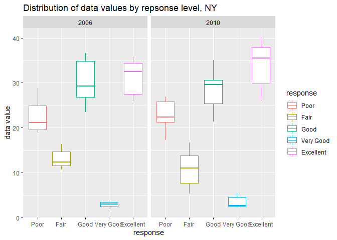

HW 3
================
Sam Loewen
10/7/2019

## Problem 1

The dataset `instacart` has 1384617 observations, with 15 variables. The
data tracks products and thier corresponding order, providing
information like `order_number`, `product_name`, and its corresponding
`aisle`. We can learn things like the preportion of products that were
reordered (0.5985944) or the average number of days since prior order
(17.0661259).

  - How many aisles are there, and which aisles are the most items
    ordered from?

<!-- end list -->

``` r
instacart %>% 
group_by (aisle_id) %>% 
  summarize (n_obs = n()) %>% 
arrange(desc(n_obs))
```

    ## # A tibble: 134 x 2
    ##    aisle_id  n_obs
    ##       <int>  <int>
    ##  1       83 150609
    ##  2       24 150473
    ##  3      123  78493
    ##  4      120  55240
    ##  5       21  41699
    ##  6      115  36617
    ##  7       84  32644
    ##  8      107  31269
    ##  9       91  26240
    ## 10      112  23635
    ## # ... with 124 more rows

There are 134 aisles, and aisles 83, 24, and 123 are the most ordered
from.

  - Make a plot that shows the number of items ordered in each aisle,
    limiting this to aisles with more than 10000 items ordered. Arrange
    aisles sensibly, and organize your plot so others can read it.

<!-- end list -->

``` r
instacart %>%
  group_by (aisle_id) %>% 
  summarize (n_obs = n()) %>% 
  filter(n_obs > 10000) %>% 
  arrange(aisle_id) %>% 
    ggplot(aes(x = aisle_id, y = n_obs, color=n_obs)) + 
    geom_point() +
    labs(title = "Number of items ordered per aisle", 
    x = "Aisle Number", 
    y = "NUmber items ordered")
```

<!-- -->

  - Make a table showing the three most popular items in each of the
    aisles “baking ingredients”, “dog food care”, and “packaged
    vegetables fruits”. Include the number of times each item is ordered
    in your table.

<!-- end list -->

``` r
instacart %>% 
group_by (aisle, product_id) %>% 
  summarize (n_obs = n()) %>% 
filter (aisle == "baking ingredients" | aisle == "dog food care" | aisle == "packaged vegetables fruits") %>% 
top_n(3, n_obs) %>% 
knitr::kable()
```

| aisle                      | product\_id | n\_obs |
| :------------------------- | ----------: | -----: |
| baking ingredients         |       23405 |    387 |
| baking ingredients         |       23537 |    499 |
| baking ingredients         |       49533 |    336 |
| dog food care              |         722 |     30 |
| dog food care              |       17471 |     26 |
| dog food care              |       23329 |     28 |
| packaged vegetables fruits |       21903 |   9784 |
| packaged vegetables fruits |       27966 |   5546 |
| packaged vegetables fruits |       39275 |   4966 |

  - Make a table showing the mean hour of the day at which Pink Lady
    Apples and Coffee Ice Cream are ordered on each day of the week;
    format this table for human readers (i.e. produce a 2 x 7 table).

<!-- end list -->

``` r
instacart %>% 
group_by (product_name, order_dow) %>%
  summarize(mean_hour = mean(order_hour_of_day)) %>% 
filter (product_name == "Pink Lady Apples" | product_name == "Coffee Ice Cream") %>%
  pivot_wider(
    names_from = order_dow,
    values_from = mean_hour) %>% 
knitr::kable()  
```

| product\_name    |        0 |        1 |        2 |        3 |        4 |        5 |        6 |
| :--------------- | -------: | -------: | -------: | -------: | -------: | -------: | -------: |
| Coffee Ice Cream | 13.77419 | 14.31579 | 15.38095 | 15.31818 | 15.21739 | 12.26316 | 13.83333 |
| Pink Lady Apples | 13.44118 | 11.36000 | 11.70213 | 14.25000 | 11.55172 | 12.78431 | 11.93750 |

## Problem 2

First, do some data cleaning:

  - format the data to use appropriate variable names;
  - focus on the “Overall Health” topic
  - include only responses from “Excellent” to “Poor”
  - organize responses as a factor taking levels ordered from “Poor” to
    “Excellent”

<!-- end list -->

``` r
brfss_smart2010_1 =
  brfss_smart2010 %>% 
  janitor::clean_names() %>% 
  filter (topic == "Overall Health",
          response == "Excellent" | 
          response == "Very good" | 
          response == "Good" | 
          response == "Fair" |
          response == "Poor") %>% 
  mutate(response = factor(response, labels = c("Poor", "Fair", "Good", "Very Good", "Excellent")))
```

Using this dataset, do or answer the following (commenting on the
results of each):

  - In 2002, which states were observed at 7 or more locations? What
    about in 2010? Construct a dataset that is limited to Excellent
    responses, and contains, year, state, and a variable that averages
    the data\_value across locations within a state.

<!-- end list -->

``` r
brfss_smart2010_2 = 
brfss_smart2010_1 %>% 
  group_by(year, locationabbr, response) %>% 
  summarize (n_loc = n_distinct(locationdesc),
             mean_dv = mean(data_value, na.rm = TRUE)) %>% 
filter(year == 2002 | year == 2010,
       n_loc >= 7,
       response == "Excellent") %>% 
select (-response, -n_loc)
```

  - Make a “spaghetti” plot of this average value over time within a
    state (that is, make a plot showing a line for each state across
    years – the geom\_line geometry and group aesthetic will help).

<!-- end list -->

``` r
brfss_smart2010_1 %>% 
  group_by(year, locationabbr, response) %>% 
  summarize (n_loc = n_distinct(locationdesc),
             mean_dv = mean(data_value, na.rm = TRUE)) %>% 
  filter(n_loc >= 7, response == "Excellent") %>% 
  ggplot(aes(x=year, y=mean_dv, group = locationabbr, color = locationabbr)) + 
  geom_point() + geom_line() +
  labs(title = "Mean data value over time, by state", 
    x = "year", 
    y = "data value")
```

<!-- -->

  - Make a two-panel plot showing, for the years 2006, and 2010,
    distribution of data\_value for responses (“Poor” to “Excellent”)
    among locations in NY State.

<!-- end list -->

``` r
brfss_smart2010_1 %>% 
  filter(locationabbr == "NY", 
         year == 2006 | year == 2010) %>% 
  select (year, locationabbr, locationdesc, response, data_value) %>% 
ggplot(aes(x = response, y = data_value)) + 
  geom_boxplot() + facet_grid(. ~ year)  +
  labs(title = "Distribution of data values by repsonse level, NY", 
    x = "response", 
    y = "data value")
```

<!-- -->
