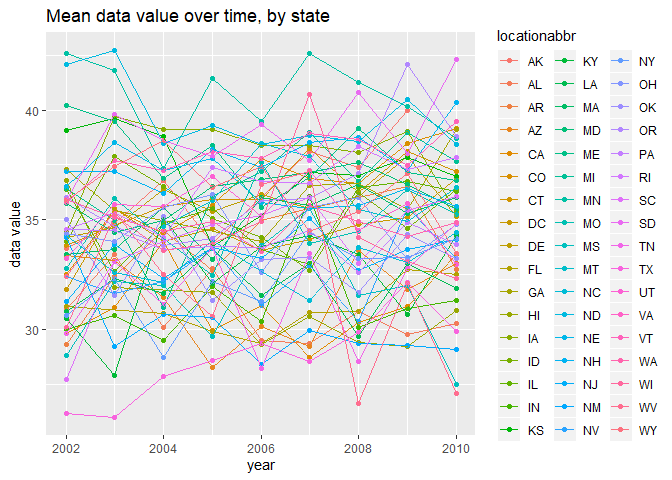

HW 3
================
Sam Loewen
10/7/2019

## Problem 1

The dataset `instacart` has 1384617 observations, with 15 variables. The
data tracks products and thier corresponding order, providing
information like `order_number`, `product_name`, and its corresponding
`aisle`. We can learn things like the preportion of products that were
reordered (0.5985944) or the average number of days since prior order
(17.0661259).

  - How many aisles are there, and which aisles are the most items
    ordered from?

<!-- end list -->

``` r
instacart %>% 
group_by (aisle_id) %>% 
  summarize (n_obs = n()) %>% 
arrange(desc(n_obs))
```

    ## # A tibble: 134 x 2
    ##    aisle_id  n_obs
    ##       <int>  <int>
    ##  1       83 150609
    ##  2       24 150473
    ##  3      123  78493
    ##  4      120  55240
    ##  5       21  41699
    ##  6      115  36617
    ##  7       84  32644
    ##  8      107  31269
    ##  9       91  26240
    ## 10      112  23635
    ## # ... with 124 more rows

There are 134 aisles, and aisles 83, 24, and 123 are the most ordered
from.

  - Make a plot that shows the number of items ordered in each aisle,
    limiting this to aisles with more than 10000 items ordered. Arrange
    aisles sensibly, and organize your plot so others can read it.

<!-- end list -->

``` r
instacart %>%
  group_by (aisle_id) %>% 
  summarize (n_obs = n()) %>% 
  filter(n_obs > 10000) %>% 
  arrange(aisle_id) %>% 
    ggplot(aes(x = aisle_id, y = n_obs, color=n_obs)) + 
    geom_point() +
    labs(title = "Number of items ordered per aisle", 
    x = "Aisle Number", 
    y = "Nmber items ordered")
```

<!-- -->

  - Make a table showing the three most popular items in each of the
    aisles “baking ingredients”, “dog food care”, and “packaged
    vegetables fruits”. Include the number of times each item is ordered
    in your table.

<!-- end list -->

``` r
instacart %>% 
group_by (aisle, product_name) %>% 
  summarize (n_obs = n()) %>% 
filter (aisle == "baking ingredients" | aisle == "dog food care" | aisle == "packaged vegetables fruits") %>% 
top_n(3, n_obs) %>% 
knitr::kable()
```

| aisle                      | product\_name                                 | n\_obs |
| :------------------------- | :-------------------------------------------- | -----: |
| baking ingredients         | Cane Sugar                                    |    336 |
| baking ingredients         | Light Brown Sugar                             |    499 |
| baking ingredients         | Pure Baking Soda                              |    387 |
| dog food care              | Organix Chicken & Brown Rice Recipe           |     28 |
| dog food care              | Small Dog Biscuits                            |     26 |
| dog food care              | Snack Sticks Chicken & Rice Recipe Dog Treats |     30 |
| packaged vegetables fruits | Organic Baby Spinach                          |   9784 |
| packaged vegetables fruits | Organic Blueberries                           |   4966 |
| packaged vegetables fruits | Organic Raspberries                           |   5546 |

  - Make a table showing the mean hour of the day at which Pink Lady
    Apples and Coffee Ice Cream are ordered on each day of the week;
    format this table for human readers (i.e. produce a 2 x 7 table).

<!-- end list -->

``` r
instacart %>% 
group_by (product_name, order_dow) %>%
  summarize(mean_hour = mean(order_hour_of_day)) %>% 
filter (product_name == "Pink Lady Apples" | product_name == "Coffee Ice Cream") %>%
  pivot_wider(
    names_from = order_dow,
    values_from = mean_hour) %>% 
knitr::kable()  
```

| product\_name    |        0 |        1 |        2 |        3 |        4 |        5 |        6 |
| :--------------- | -------: | -------: | -------: | -------: | -------: | -------: | -------: |
| Coffee Ice Cream | 13.77419 | 14.31579 | 15.38095 | 15.31818 | 15.21739 | 12.26316 | 13.83333 |
| Pink Lady Apples | 13.44118 | 11.36000 | 11.70213 | 14.25000 | 11.55172 | 12.78431 | 11.93750 |

## Problem 2

First, do some data cleaning:

  - format the data to use appropriate variable names;
  - focus on the “Overall Health” topic
  - include only responses from “Excellent” to “Poor”
  - organize responses as a factor taking levels ordered from “Poor” to
    “Excellent”

<!-- end list -->

``` r
brfss_smart2010_1 =
  brfss_smart2010 %>% 
  janitor::clean_names() %>% 
  filter (topic == "Overall Health",
          response == "Excellent" | 
          response == "Very good" | 
          response == "Good" | 
          response == "Fair" |
          response == "Poor") %>% 
  mutate(response = factor(response, labels = c("Poor", "Fair", "Good", "Very Good", "Excellent")))
```

Using this dataset, do or answer the following (commenting on the
results of each):

  - In 2002, which states were observed at 7 or more locations? What
    about in 2010?

<!-- end list -->

``` r
brfss_smart2010_1 %>% 
  group_by(year, locationabbr) %>% 
  summarize (n_loc = n_distinct(locationdesc),
             mean_dv = mean(data_value, na.rm = TRUE)) %>% 
filter(year == 2002 | year == 2010,
       n_loc >= 7) %>% 
select (-n_loc) %>% 
arrange(year, locationabbr)
```

    ## # A tibble: 20 x 3
    ## # Groups:   year [2]
    ##     year locationabbr mean_dv
    ##    <int> <chr>          <dbl>
    ##  1  2002 CT              20  
    ##  2  2002 FL              20.0
    ##  3  2002 MA              20.0
    ##  4  2002 NC              20  
    ##  5  2002 NJ              20.0
    ##  6  2002 PA              20.0
    ##  7  2010 CA              20.0
    ##  8  2010 CO              20.0
    ##  9  2010 FL              19.9
    ## 10  2010 MA              20  
    ## 11  2010 MD              20.0
    ## 12  2010 NC              20.0
    ## 13  2010 NE              20.0
    ## 14  2010 NJ              20  
    ## 15  2010 NY              20  
    ## 16  2010 OH              20.0
    ## 17  2010 PA              20.0
    ## 18  2010 SC              19.6
    ## 19  2010 TX              20.0
    ## 20  2010 WA              20.0

In 2002, CT, FL, MA, NC, NJ, and PA all were observed in 7 or more
locations. In 2010, CA, CO, FL, MA, MD, NC, NE, NJ, NY, OH, PA, SC, TX,
and WA were observed in 7 or more locations.

  - Construct a dataset that is limited to Excellent responses, and
    contains, year, state, and a variable that averages the data\_value
    across locations within a state. Make a “spaghetti” plot of this
    average value over time within a state (that is, make a plot showing
    a line for each state across years – the geom\_line geometry and
    group aesthetic will help).

<!-- end list -->

``` r
brfss_smart2010_2 =
brfss_smart2010_1 %>% 
  group_by(year, locationabbr, response) %>% 
  summarize (mean_dv = mean(data_value, na.rm = TRUE)) %>% 
filter(response == "Excellent") %>% 
select (-response) %>% 
arrange(year, locationabbr)

brfss_smart2010_2
```

    ## # A tibble: 443 x 3
    ## # Groups:   year, locationabbr [443]
    ##     year locationabbr mean_dv
    ##    <int> <chr>          <dbl>
    ##  1  2002 AK              33.7
    ##  2  2002 AL              30.9
    ##  3  2002 AR              29.3
    ##  4  2002 AZ              33.4
    ##  5  2002 CA              29.8
    ##  6  2002 CO              32.5
    ##  7  2002 CT              33.8
    ##  8  2002 DC              31.8
    ##  9  2002 DE              34.2
    ## 10  2002 FL              31.1
    ## # ... with 433 more rows

``` r
brfss_smart2010_2 %>% 
  ggplot(aes(x=year, y=mean_dv, group = locationabbr, color = locationabbr)) + geom_point() + geom_line() +
  labs(title = "Mean data value over time, by state", 
    x = "year", 
    y = "data value")
```

<!-- -->

The mean data values across states range from 26 to 42.7. The meadian
values by year are: 2002: 34, 2004: 34.4166667, 2006: 34.9, 2008:
35.1383333, and 2010: 34.89.

  - Make a two-panel plot showing, for the years 2006, and 2010,
    distribution of data\_value for responses (“Poor” to “Excellent”)
    among locations in NY State.

<!-- end list -->

``` r
brfss_smart2010_1 %>% 
  filter(locationabbr == "NY", 
         year == 2006 | year == 2010) %>% 
ggplot(aes(x = response, y = data_value, color = response)) + 
  geom_boxplot() + facet_grid(. ~ year)  +
  labs(title = "Distribution of data values by repsonse level, NY", 
    x = "response", 
    y = "data value")
```

<!-- --> In 2006, the
largest range of values within a category was in `Good`. The smallest
distrubution was among `Very Good`, which also has the lowest data
values. In 2010 the highest data values and the largest distributions of
values was in the `Excellent` group. Again the smallest values and
smallest distribution was in the `Very Good` group.

## Problem 3

  - Load, tidy, and otherwise wrangle the data. Your final dataset
    should include all originally observed variables and values; have
    useful variable names; include a weekday vs weekend variable; and
    encode data with reasonable variable classes. Describe the resulting
    dataset (e.g. what variables exist, how many observations, etc).

<!-- end list -->

``` r
accel = 
  read_csv("./data/accel_data.csv") %>% 
  janitor::clean_names() %>% 
  mutate(day = factor(day, labels = c("Monday", "Tuesday", "Wednesday", "Thursday", "Friday", "Saturday", "Sunday")),
         weekend = as.numeric(if_else(day == "Saturday" | day == "Sunday", "1", "0"))) %>% 
  select (week, day_id, day, weekend, everything()) %>% 
  arrange (week, day)
```

    ## Parsed with column specification:
    ## cols(
    ##   .default = col_double(),
    ##   day = col_character()
    ## )

    ## See spec(...) for full column specifications.

The dataset `accel` has 35 observations, with 1444 variables. The data
tracks one man’s activity every day for 5 weeks, reporting activity
every minute. A unit of activity is captued every minute and is
represented in our data set with varaibles `acitvity_1` through
`activity_1440`.

  - Traditional analyses of accelerometer data focus on the total
    activity over the day. Using your tidied dataset, aggregate accross
    minutes to create a total activity variable for each day, and create
    a table showing these totals. Are any trends apparent?

<!-- end list -->

``` r
accel_2 =
  accel %>% 
  pivot_longer(
    activity_1:activity_1440,
    names_to = "minute",
    values_to = "activity") %>% 
  group_by(week, day_id, day, weekend) %>% 
  summarize(daily_tot = sum(activity))
knitr::kable(accel_2)
```

| week | day\_id | day       | weekend | daily\_tot |
| ---: | ------: | :-------- | ------: | ---------: |
|    1 |       1 | Monday    |       0 |  480542.62 |
|    1 |       2 | Tuesday   |       0 |   78828.07 |
|    1 |       3 | Wednesday |       0 |  376254.00 |
|    1 |       4 | Thursday  |       0 |  631105.00 |
|    1 |       5 | Friday    |       0 |  355923.64 |
|    1 |       6 | Saturday  |       1 |  307094.24 |
|    1 |       7 | Sunday    |       1 |  340115.01 |
|    2 |       8 | Monday    |       0 |  568839.00 |
|    2 |       9 | Tuesday   |       0 |  295431.00 |
|    2 |      10 | Wednesday |       0 |  607175.00 |
|    2 |      11 | Thursday  |       0 |  422018.00 |
|    2 |      12 | Friday    |       0 |  474048.00 |
|    2 |      13 | Saturday  |       1 |  423245.00 |
|    2 |      14 | Sunday    |       1 |  440962.00 |
|    3 |      15 | Monday    |       0 |  467420.00 |
|    3 |      16 | Tuesday   |       0 |  685910.00 |
|    3 |      17 | Wednesday |       0 |  382928.00 |
|    3 |      18 | Thursday  |       0 |  467052.00 |
|    3 |      19 | Friday    |       0 |  371230.00 |
|    3 |      20 | Saturday  |       1 |  381507.00 |
|    3 |      21 | Sunday    |       1 |  468869.00 |
|    4 |      22 | Monday    |       0 |  154049.00 |
|    4 |      23 | Tuesday   |       0 |  409450.00 |
|    4 |      24 | Wednesday |       0 |    1440.00 |
|    4 |      25 | Thursday  |       0 |  260617.00 |
|    4 |      26 | Friday    |       0 |  340291.00 |
|    4 |      27 | Saturday  |       1 |  319568.00 |
|    4 |      28 | Sunday    |       1 |  434460.00 |
|    5 |      29 | Monday    |       0 |  620860.00 |
|    5 |      30 | Tuesday   |       0 |  389080.00 |
|    5 |      31 | Wednesday |       0 |    1440.00 |
|    5 |      32 | Thursday  |       0 |  138421.00 |
|    5 |      33 | Friday    |       0 |  549658.00 |
|    5 |      34 | Saturday  |       1 |  367824.00 |
|    5 |      35 | Sunday    |       1 |  445366.00 |

This data show the mean activity per day: Monday - 4.583421210^{5},
Tuesday - 3.717398110^{5}, Wednesday - 2.73847410^{5}, Thursday -
3.83842610^{5}, Friday - 4.182301310^{5}, Saturday - 3.598476510^{5},
and Sunday - 4.25954410^{5}. This indicates that Mondays are the most
active day of the week.

The mean weekday value is 3.812004110^{5} and mean weekend value is
3.929010310^{5}, showing that weekends are slightly more active than
weekdays.

  - Accelerometer data allows the inspection activity over the course of
    the day. Make a single-panel plot that shows the 24-hour activity
    time courses for each day and use color to indicate day of the week.
    Describe in words any patterns or conclusions you can make based on
    this graph.

<!-- end list -->

``` r
accel_plot = 
  accel %>% 
  pivot_longer(
    activity_1:activity_1440,
    names_to = "minute",
    values_to = "activity") %>% 
ggplot(aes(x=day_id, y=activity, group = minute, color = day)) + 
  geom_point() + geom_line() +
  labs(title = "24 hour activity over 5 weeks", 
    x = "day", 
    y = "activity unit")
accel_plot
```

<!-- --> This chart
appears to show that activity spikes in the middle of the day, as is to
be expected given typical sleep schedules. This person appears to be
slightly more active over the weekends, but they appeared to have one
very active weekend that may be skewing the results. Similarly this
person had one very inactive Friday-Saturday that seem like outliers
among their typical activity pattern.
